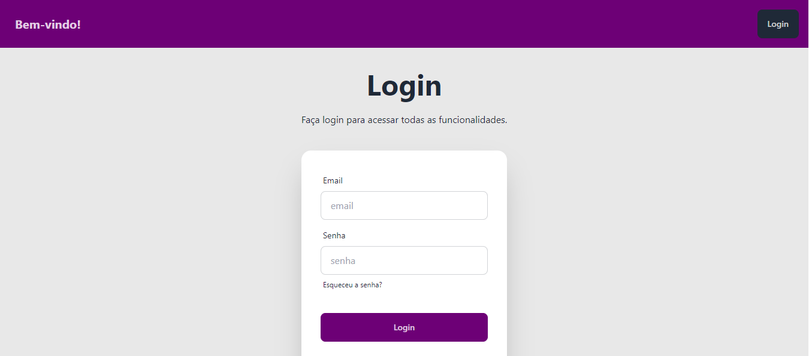
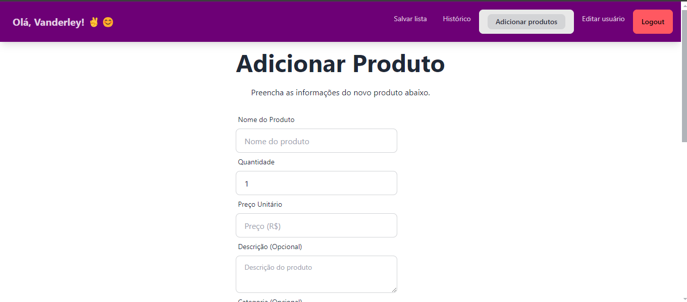
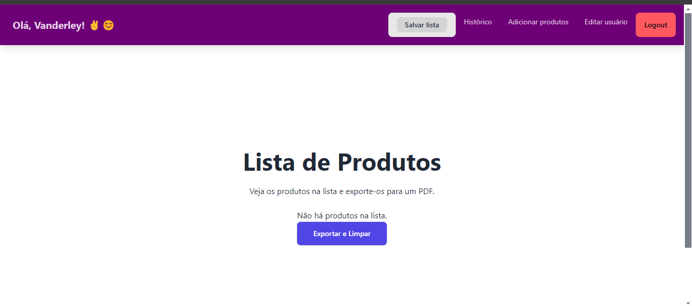
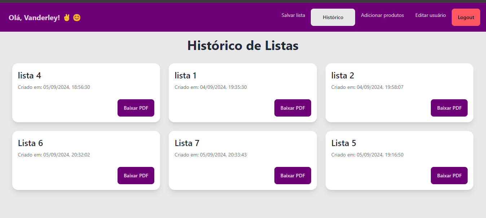

<h1>🛒 Gerenciador de Produtos</h1>

  

    
  

  
<strong>Uma solução moderna e eficiente para gerenciamento de produtos</strong>

  

    
    
    
    
    
  

  

  <h2 id="funcionalidades">✨ Funcionalidades</h2>

  <table border="1" width="100%">
    <tr>
      <td align="center">📝 Gerenciamento intuitivo de produtos</td>
      <td align="center">📊 Análises e histórico detalhados</td>
      <td align="center">🔒 Autenticação robusta</td>
    </tr>
    <tr>
      <td align="center">📁 Exportação e armazenamento em PDF</td>
      <td align="center">🔍 Busca inteligente em tempo real</td>
      <td align="center">📱 Design responsivo multiplataforma</td>
    </tr>
  </table>

  <ul>
    <li>Gerencie seus produtos com uma interface intuitiva e amigável.</li>
    <li>Acompanhe análises detalhadas e histórico completo dos produtos.</li>
    <li>Segurança com autenticação robusta e proteção de dados.</li>
    <li>Exporte dados facilmente em PDF para backup e acesso off-line.</li>
    <li>Busca rápida e precisa com a ferramenta de busca em tempo real.</li>
    <li>Aplicação totalmente responsiva e otimizada para dispositivos móveis.</li>
  </ul>

  

  <h2 id="tecnologias-utilizadas">🛠️ Tecnologias Utilizadas</h2>

  

    
    
    
    
    
    
    
  

  
As tecnologias utilizadas garantem uma aplicação rápida, moderna e eficiente, com alta performance e uma ótima experiência para o usuário.

  

  <h2 id="capturas-de-tela">📸 Capturas de Tela</h2>

  

    
    
<em>Adicione produtos de forma rápida e eficiente</em>
 
  

    
    
<em>Salve e exporte seus produtos com facilidade</em>

  

    
    
<em>Visualize o histórico completo dos seus produtos</em>

  

  

 
  <h2 id="recursos-de-seguranca">🔐 Recursos de Segurança</h2>
  <ul>
    <li><strong>Acesso Personalizado</strong>: Somente o usuário logado pode ver seus dados pessoais.</li>
    <li><strong>Armazenamento Seguro</strong>: PDFs e outros dados são armazenados com criptografia de ponta a ponta.</li>
    <li><strong>Controle de Acesso</strong>: Baseado em permissões e funções de usuário, garantindo que apenas pessoas autorizadas tenham acesso.</li>
  </ul>

  

  <h2 id="desenvolvedor">👨‍💻 Desenvolvedor</h2>

  

    
    
<strong>Vanderley Oliveira</strong>

    
    
  

  

  <h2>🙏 Agradecimentos</h2>

  
Um agradecimento especial à comunidade open-source e aos criadores das tecnologias que tornaram este projeto possível.

  

  

    
<strong>Feito com ❤️ e ☕ por <a href="https://www.vanderleynascimento.online/">Vanderley Oliveira</a></strong>

    
© 2024 Gerenciador de Produtos. Todos os direitos reservados.

  

